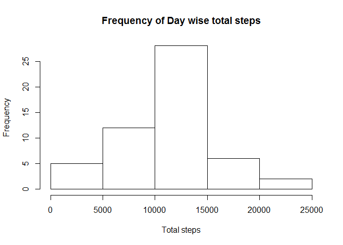
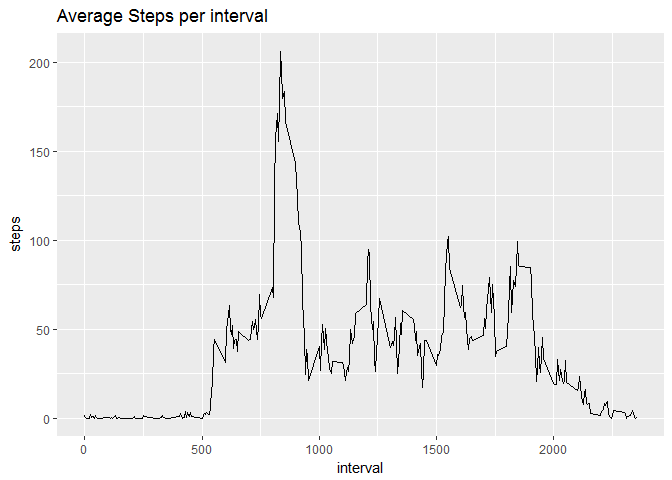
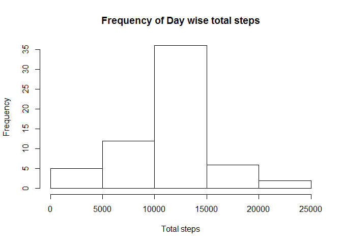
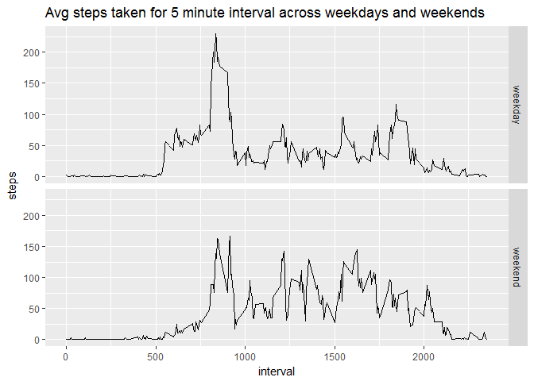

# Reproducible Research: Peer Assessment 1


Load the required packages

```r
library(dplyr)
library(ggplot2)
```

## Loading and preprocessing the data
- Read the csv file of the data

```r
data <- read.csv("./activity/activity.csv")
```

## What is mean total number of steps taken per day?
Histogram of frequency of steps taken per day

```r
good <- complete.cases(data)
data1 <- data[good,]
grp_by_date <- group_by(data1,date)
daywise_total_steps <- summarize(grp_by_date,totalSteps=sum(steps,na.rm = TRUE))
hist(daywise_total_steps$totalSteps,xlab = "Total steps", main = "Frequency of Day wise total steps")
```

<!-- -->

Mean steps taken per day

```r
mean_steps <- mean(daywise_total_steps$totalSteps)
mean_steps
```

[1] 10766.19

Median of total steps taken per day

```r
median_steps <- median(daywise_total_steps$totalSteps)
median_steps
```

[1] 10765

## What is the average daily activity pattern?
Make a time series plot

```r
aggregate_data <- aggregate(steps~interval,data1,mean)
g <- ggplot(aggregate_data,aes(interval,steps))
g + geom_line() + labs(title = "Average Steps per interval")
```

<!-- -->

5 minute interval which contains maximum number of steps

```r
aggregate_data[which.max(aggregate_data$steps),]
```

```
##     interval    steps
## 104      835 206.1698
```

## Imputing missing values
Get the count of NA in the data

```r
missing_values <- sum(is.na(data))
```
The count of the missing values i.e. NA is ``2304``

Now assign the NA values with the corresponding interval mean

```r
imputed_data <- data
for(i in 1:length(imputed_data$steps))
{
    if(is.na(imputed_data$steps[i]))
    {
        imputed_data$steps[i] <- aggregate_data$steps[aggregate_data$interval == imputed_data$interval[i]]
    }
}
```
First few rows of the new data set with imputed values

```r
head(imputed_data)
```

```
##       steps       date interval
## 1 1.7169811 2012-10-01        0
## 2 0.3396226 2012-10-01        5
## 3 0.1320755 2012-10-01       10
## 4 0.1509434 2012-10-01       15
## 5 0.0754717 2012-10-01       20
## 6 2.0943396 2012-10-01       25
```
Histogram for the imputed data set for the total number of steps taken each day

```r
grp_by_date_imputed_data <- group_by(imputed_data,date)
daywise_total_steps_imputed_data <- summarize(grp_by_date_imputed_data,totalSteps=sum(steps,na.rm = TRUE))
hist(daywise_total_steps_imputed_data$totalSteps,xlab = "Total steps", main = "Frequency of Day wise total steps")
```

<!-- -->

Mean day wise total steps for the imputed data

```r
imputed_mean <- mean(daywise_total_steps_imputed_data$totalSteps)
imputed_mean <- round(imputed_mean)
imputed_mean
```

[1] 10766

Median day wise total steps for the imputed data

```r
imputed_median <- median(daywise_total_steps_imputed_data$totalSteps)
imputed_median <- round(imputed_median)
imputed_median
```

[1] 10766


```r
paste("Original Mean: ",mean_steps,"; Imputed Mean: ",imputed_mean,sep = "")
```

```
## [1] "Original Mean: 10766.1886792453; Imputed Mean: 10766"
```

```r
paste("Original median: ",median_steps,"; Imputed Median: ",imputed_median,sep="")
```

```
## [1] "Original median: 10765; Imputed Median: 10766"
```
The mean is same for original data and imputed data

The median is similar for the original data and the imputed data

## Are there differences in activity patterns between weekdays and weekends?
Mark saturdays and sundays as weekends and remaining days as weekdays

```r
imputed_data$date <- as.Date(imputed_data$date)
imputed_data['day_of_the_week']<-weekdays(imputed_data$date)
imputed_data['day_type'] <- imputed_data$day_of_the_week
imputed_data$day_type[imputed_data$day_of_the_week %in% c("Saturday","Sunday")] <- "weekend"
imputed_data$day_type[imputed_data$day_type != "weekend"] <- "weekday"
```
convert the day type to factor

```r
imputed_data$day_type <- as.factor(imputed_data$day_type)
```
compute the day type wise aggregate of steps with respect to interval

```r
daytypewise_aggregate_data <- aggregate(steps~interval + day_type,imputed_data,mean)
```
This time plotting in ggplot, the plot looks as below

```r
g <- ggplot(daytypewise_aggregate_data,aes(interval,steps))
g + geom_line() + facet_grid(day_type~.) + labs(title = "Avg steps taken for 5 minute interval across weekdays and weekends")
```

<!-- -->
